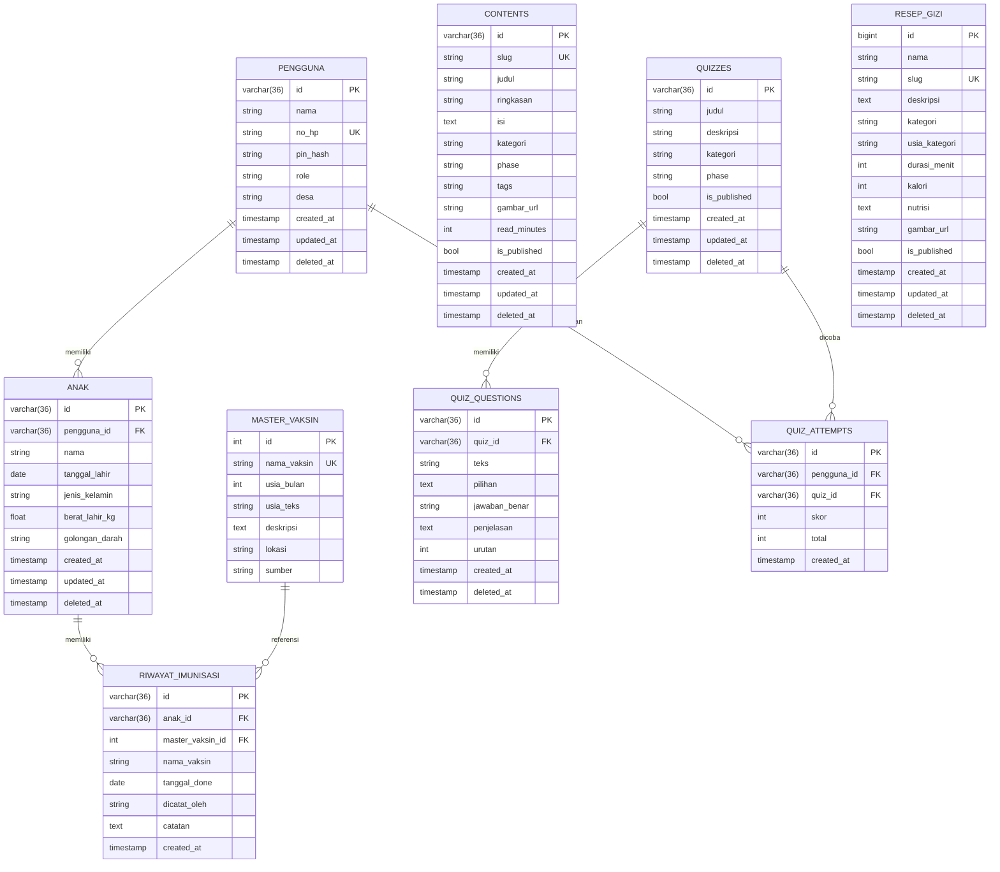
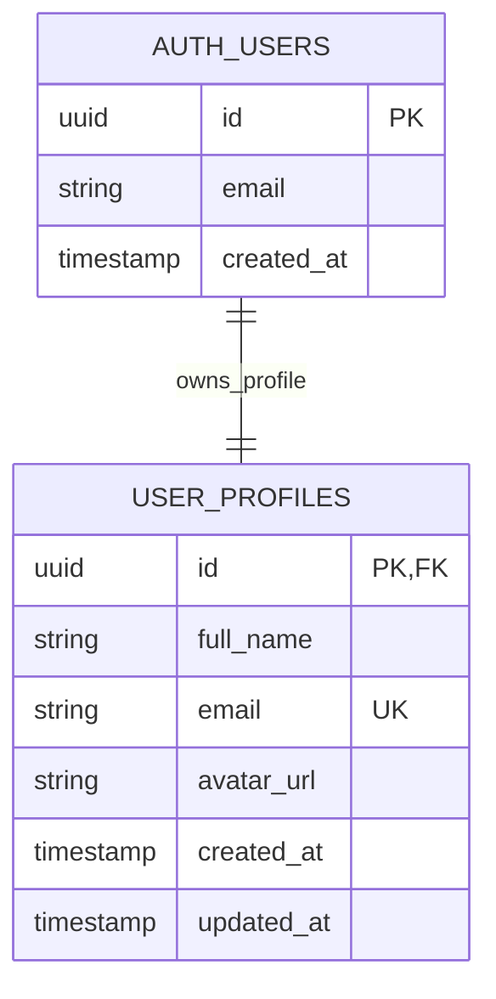
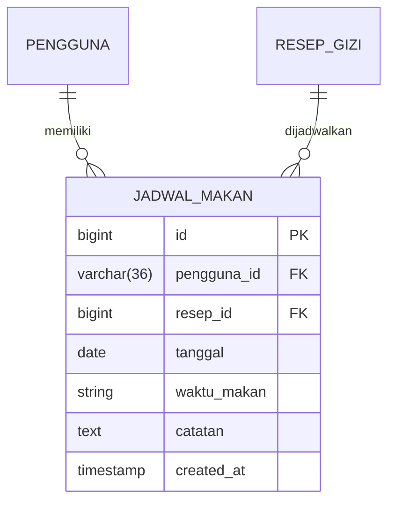

# Database UML Plan (KIA)

Dokumen ini merangkum rencana UML/ERD untuk seluruh layer data pada project KIA berdasarkan model GORM aktif dan setup Supabase.

## 1) Sumber Kebenaran Schema

- AutoMigrate aktif di backend: `backend/app/app.go`
- Model database utama: `backend/app/models/*.go`
- Setup auth/profile Supabase: `SETUP_SUPABASE.md`

## 2) ERD Utama (Database Aplikasi - Postgres/GORM)

## 3) ERD Auth/Profile (Supabase)

Catatan: tabel ini dikelola di Supabase, bukan AutoMigrate backend.

## 4) Tabel Planned (Belum Persisten di DB Saat Ini)

Entity di bawah sudah ada pada level API/model view, tetapi belum dimasukkan ke AutoMigrate:

- JadwalMakan (saat ini masih disimpan in-memory map di controller gizi)
- Bookmark (endpoint masih stub)
- Profile domain aplikasi (backend endpoint masih stub; Supabase profile sudah ada sebagai opsi)

Contoh draft ERD untuk planned table `jadwal_makan`:

## 5) Catatan Implementasi

- Kolom soft delete digunakan pada beberapa tabel (`deleted_at`) via GORM.
- Relasi foreign key eksplisit sudah ada di model `Anak`, `RiwayatImunisasi`, dan `QuizQuestion`.
- Pastikan penambahan FK constraint fisik di DB mengikuti environment Supabase (transaction pooler + migration strategy).

## 6) Prioritas Eksekusi Rencana

1. Stabilkan schema aktif sesuai ERD utama.
2. Putuskan satu sumber profile: `pengguna` internal atau `user_profiles` Supabase.
3. Implementasikan persistence untuk `jadwal_makan` dan `bookmark`.
4. Tambahkan migration SQL versioned agar tidak bergantung penuh pada AutoMigrate.
